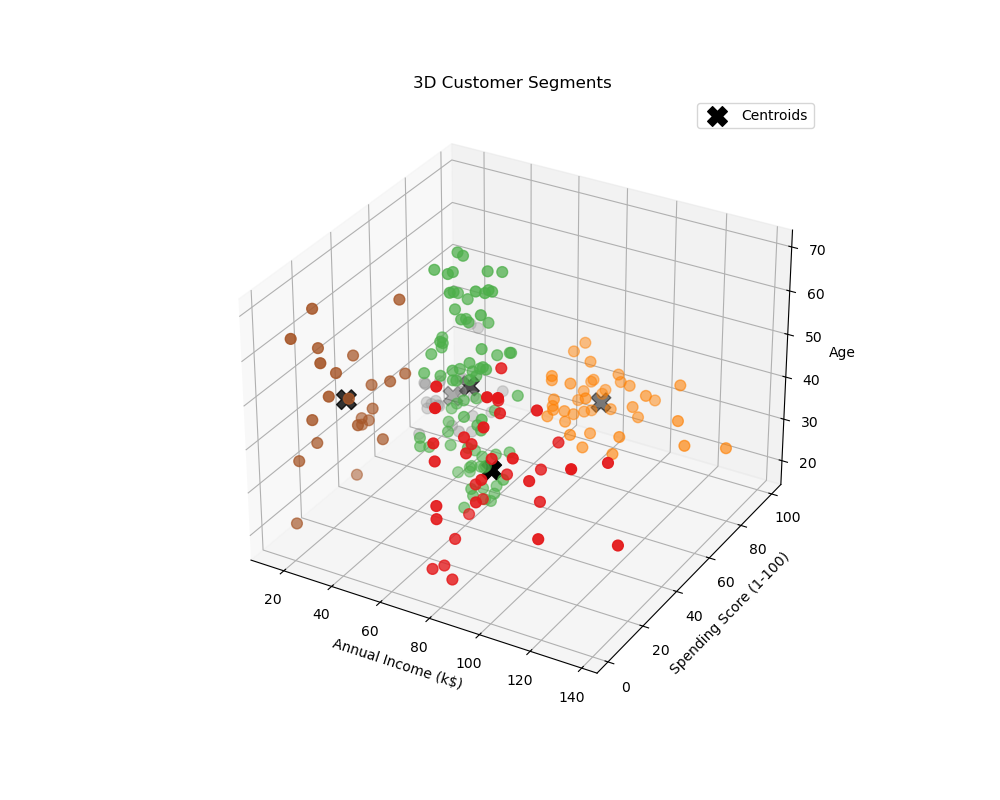

# Mall Customer Segmentation with KMeans

  

This project demonstrates how **unsupervised machine learning (clustering)** can be applied to identify distinct customer groups in a retail/mall setting.  
By analyzing **Annual Income** and **Spending Score**, we can uncover patterns in customer behavior and design **targeted marketing strategies**.

---

## Problem Statement
Mall owners want to understand their customer base:  
- Who are the **high-value customers (VIPs)**?  
- Which customers are **wealthy but disengaged**?  
- Which groups are **price-sensitive**?  
- Which customers are **low priority** for marketing?  

Clustering provides a data-driven way to answer these questions.

---

## 🧑‍💻 Methods
1. **Exploratory Data Analysis (EDA)**  
   - Gender distribution, age, income, and spending visualizations.  
   - Correlation heatmap.  

2. **Clustering Approach**  
   - Feature selection: Annual Income + Spending Score.  
   - **Elbow Method** to find optimal number of clusters (k=5).  
   - **KMeans clustering** to assign customers into segments.  

3. **Visualization**  
   - 2D scatter plots with clusters & centroids.  
   - 3D scatter plot (Income, Spending, Age).  

---

## Results
- The Elbow Method suggested **5 clusters**.  
- Segmentation revealed clear groups:
  - **Cluster 0:** High Income – Low Spending (wealthy but disengaged)  
  - **Cluster 1:** Average Income – Average Spending (mainstream shoppers)  
  - **Cluster 2:** High Income – High Spending (VIPs, most valuable)  
  - **Cluster 3:** Low Income – Low Spending (low priority)  
  - **Cluster 4:** Low Income – High Spending (price-sensitive but active)  

---

## Business Value
- Focus on **VIPs** with loyalty rewards and premium offers.  
- Engage **wealthy but disengaged** customers with personalized campaigns.  
- Retain **price-sensitive active spenders** with targeted discounts.  
- Reduce marketing costs by avoiding low-value groups.  

This segmentation gives mall management a **data-driven strategy** to improve marketing efficiency and customer satisfaction.  
